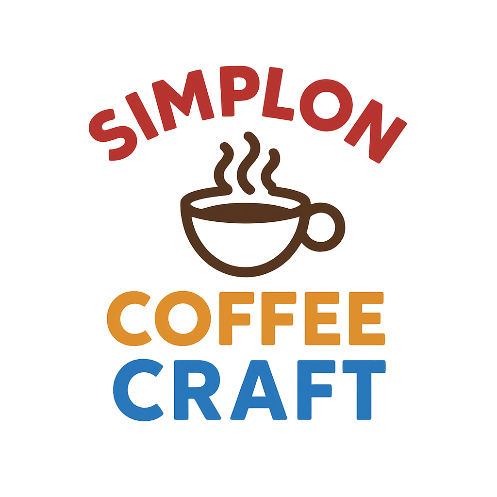

# SimplonCoffeeCraft

L'objectif est de créer une petite application web permettant de générer

    

## Contexte du projet

Le café **CoffeeCraft** souhaite ouvrir son premier site internet pour promouvoir son concept de cafés artisanaux et d'ateliers de torréfaction.  
Ils ont fait appel à votre agence web pour la création du site vitrine.

Il a également partagé un pack d'images libres de droits ainsi que les polices de caractères à utiliser.

## Particularités à respecter

- Le client tient beaucoup à **l'ambiance chaleureuse** et **authentique** de son café : la charte graphique devra être respectée.
- Il n'a pas fourni de maquettes pour mobile et tablette. À vous de **faire preuve de créativité** pour adapter les pages en responsive.
- La navigation principale (header) doit rester **visible en haut de page** sur desktop pendant le scroll (effet sticky).

Le client demande également que le projet soit réalisé **exclusivement en HTML et TailwindCSS**, sans utiliser d'autres frameworks ou bibliothèques externes (ex : pas de Bootstrap, pas de jQuery).

## Modalités pédagogiques

- Travail en **binôme** (2 personnes).
- Deadline pour le rendu : **Vendredi 3 mai 2025 à 16h**.
- Vous aurez des points bonus si vous utilisez Tailwind de manière **structurée** (ex : classes composées, extraction de composants si besoin).

Comme pour un vrai client, **votre formateur jouera le rôle du client** :  
Il pourra **répondre partiellement** à vos questions, **ou pas du tout**, pour vous pousser à proposer vos propres solutions.

## Modalités d'évaluation

- **Présentation orale** rapide du projet (~5 minutes par binôme).
- **Retour personnalisé** du formateur.

## Livrables

- Un **dépôt Github** contenant :
  - Le code source complet (HTML + TailwindCSS)
  - Un fichier `README.md` expliquant brièvement :
    - Le fonctionnement
    - Les choix faits pour le responsive
  - Une capture d'écran de la version mobile de la page d'accueil (obligatoire)

## Critères de performance

- L'**adaptation mobile** est cohérente et élégante.
- Le **responsive** est géré de manière **propre** avec Tailwind (breakpoints, flexibilité, lisibilité).
- Le code HTML est **sémantique** et **valide** W3C.
- Les bonnes pratiques Tailwind sont respectées (réduction des classes inutiles, réutilisation de styles si nécessaire).
- Présentation orale fluide et professionnelle.

## Ressources

- [JavaScript](https://developer.mozilla.org/fr/docs/Web/JavaScript)
- [Tailwind CSS](https://tailwindcss.com/)
- [daisyUI](https://daisyui.com/)

 **Images libre de droit**
- [Unsplash](https://unsplash.com/)
- [Pexels](https://www.pexels.com/fr-fr/)
- [Pixabay](https://pixabay.com/)

## Auteurs, contributeurs

- [Yassen ABARJI](https://github.com/yabarji59)
